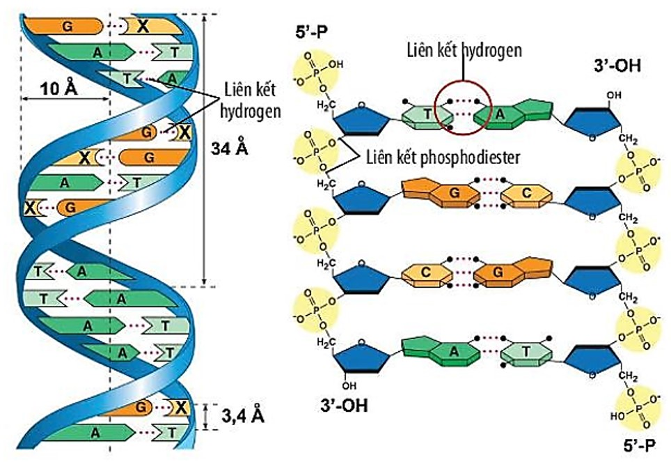

# 1. The BIG IDEAS:
## 1.1 DNA được cấu tạo theo nguyên tắc đa phân và NTBS (Nguyên tắc bổ sung) nên thực hiện được chức năng mang, bảo quản và truyền đạt thông tin di truyền.
- Nguyên tắc đa phân: là một nguyên tắc dùng để tạo ra các đại phân tử sinh học (DNA, RNA, protein, …) từ các đơn vị nhỏ hơn gọi là đơn phân (A, T, G, X - nucleotide)
- Nguyên tắc bổ sung (NTBS): nguyên tắc liên kết các  là các hợp chất hữu cơ chứa nguyên tử nitơ, là thành phần quan trọng cấu tạo nên các đơn phân nucleotide  đối diện trên hai mạch đơn của DNA hoặc RNA bằng các liên kết hydro đặc hiệu [^1]: 
	- A - T
	- G - X 
[^1]: là kiểu liên kết yếu được hình thành giữa các base nitrogen đối diện trên hai mạch đơn của phân tử DNA hoặc RNA, trong đó từng loại base chỉ có thể liên kết với một loại base cụ thể theo nguyên tắc bổ sung. 

## 1.2 DNA được tái bản theo nguyên tắc bán bảo toàn, một mạch DNA được dùng làm khuôn tổng hợp nên mạch mới theo NTBS. Do vậy, từ một phân tử “mẹ” tạo ra được hai phân tử DNA “con” giống nhau và giống với phân tử DNA mẹ
- tái bản: quá trình sao chép DNA để tạo ra 2 phân tử DNA con giống hệt mẹ.
- nguyên tắc bán bảo toàn: trong mỗi phân tử DNA con mới tạo thành, một mạch giữ lại nguyên vẹn từ DNA mẹ (mạch cũ), trong khi mạch còn lại được tổng hợp mới hoàn toàn dựa trên mạch khuôn cũ. Do đó, mỗi phân tử DNA sau tái bản gồm một mạch cũ và một mạch mới.
- khuôn tổng hợp: là mạch đơn của DNA mẹ được tách ra và đóng vai trò làm khuôn mẫu để tổng hợp mạch mới.
---
# 2. The SMALLER IDEAS:
## 2.1 Mô hình cấu trúc DNA theo Watson và Crick


Từ hình trên ta có thể thấy:
DNA được cấu trúc kiểu chuỗi xoắn kép (2 mạch polynucleotide đối song song) nên có cấu trúc bền vững nhưng có khả năng tách rời, đảm bảo thông tin di truyền được bảo quản ít bị hư hỏng.

## 2.2 Tại sao protein tạo nên các tính trạng của sinh vật nhưng không thể đảm nhận chức năng của một vật chất di truyền?

### 2.2.1 Protein tạo nên tính trạng vì tham gia trực tiếp vào cấu trúc và chức năng của tế bào 

### 2.2.2 Protein không đảm nhận chức năng của một vật chất di truyền vì:

- không được cấu tạo theo nguyên tắc bổ sung (như DNA) → không có khả năng lưu trữ, bảo quản và truyền đạt thông tin di truyền.
- không có khả năng tự nhân đôi hay sao chép thông tin cho thế hệ tiếp theo

## 2.3 Quá trình tái bản DNA (this yucks)


DNA được cấu tạo từ 2 mạch ngược chiều nhau 3’ và 5’ 
(cuối mạch 3’ là 5’ và cuối mạch 5’ là 3’).

Điều này sẽ quyết định tới quá trình tái bản của từng mạch


Bước 1: Tách DNA thành 2 mạch riêng biệt sử dụng enzyme helicase (enzyme tách mạch). Mỗi một mạch sẽ trở thành một khuông mẫu để tạo nên 1 sợi DNA mới. 

> Enzyme Helicase đóng vai trò là một cái zipper kéo “mở khoá” đoạn DNA

Bước 2: Tiếp theo thì enzyme Primase (RNA polymerase) bắt đầu quá trình
enzyme tạo một mảnh nhỏ RNA gọi là Primer (đoạn mồi) - cái này sẽ đánh dấu sự hình thành của sợi DNA mới.

> RNA polymerase làm kiến trúc sư đánh dấu nơi cần làm việc.

Bước 3: 
- DNA polymerase sẽ gắn vào Primer dựa vào đó tạo một sợi DNA mới. Tuy nhiên thì DNA polymerase chỉ có thể tạo base DNA 5’ tới 3’. Leading strand (tức là mạch 3’ → 5’ ban đầu) sẽ được DNA này tạo liên tục theo chiều 5’ → 3’ (tách tới đâu làm tới đấy)

- Lagging strand (mạch 5’ → 3’ ban đầu) không thể tạo theo cách tương tự như trên mà phải làm theo hướng ngược lại. Vì thế mà DNA polymerase chỉ có thể từ từ tạo ra từng đoạn nhỏ gọi là Okazaki. Mỗi đoạn Okazaki bắt đầu bằng một đoạn Primer và sau đó DNA polymerase sẽ làm việc từ 5’ tới 3’ (giống ở Leading Strand). Đoạn Primer tiếp theo sẽ được tạo ở một đoạn chưa được ghép base ở xa hơn → Tạo ra một đoạn Okazaki tiếp theo và quá trình tiếp tục diễn ra cho hết khuôn.

>DNA polymerase sẽ dựa vào bản vẽ của kiến trúc sư RNA polymerase mà xây đoạn base mới tương xứng. tuy nhiên thì DNA polymerase chỉ có thể xây theo chiều 3’ → 5’ vì vậy mà ở mạch 5’ → 3’ RNA polymerase cần tạo nhiều đoạn mồi khác nhau để DNA polymerase làm việc

Bước 4: Trong lúc đó, enzyme Exonuclease gỡ hết các đoạn Primer ở trên cả hai mạch mới được tạo và một DNA polymerase sẽ nhảy vô và fill hết chỗ còn lại.

Bước 5: Cuối cùng, enzyme DNA ligase (enzyme nối) sẽ seal lại hết các đoạn DNA ở cả 2 mạch để tạo thành 2 sợi DNA liên tục.

> DNA ligase đóng vai trò là “thợ hàn/ thợ  sơn” dán hết những chỗ hở lại để biến sản phẩm hoàn chỉnh
## References
1. [DNA Replication - 3D](https://www.youtube.com/watch?v=TNKWgcFPHqw)
2. [How to study BIOLOGY so FAST that it feels ILLEGAL](https://www.youtube.com/watch?v=-qU1mQ0ilxo) - this shit is tuff, recommend checking out